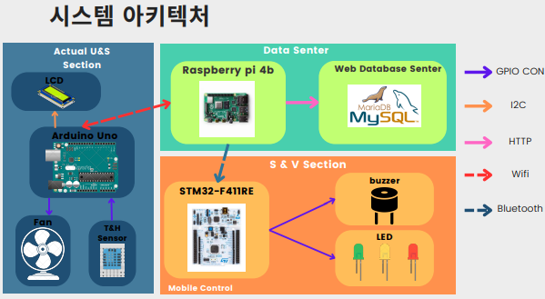
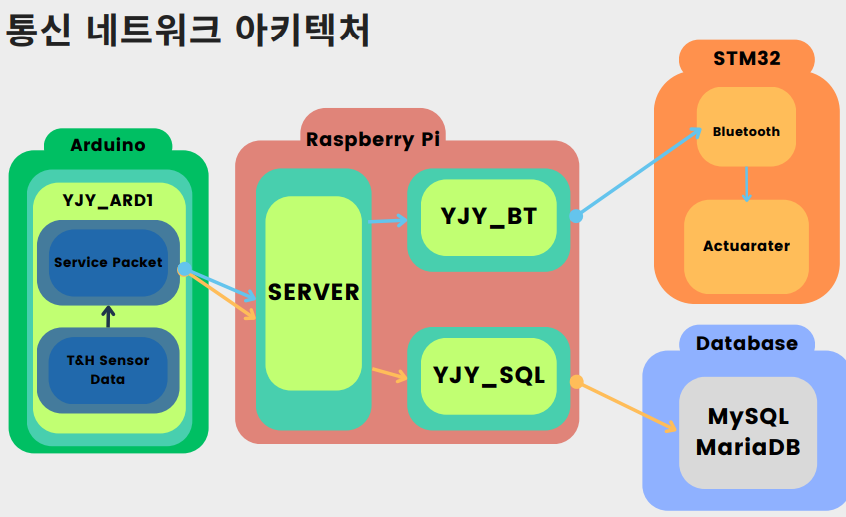
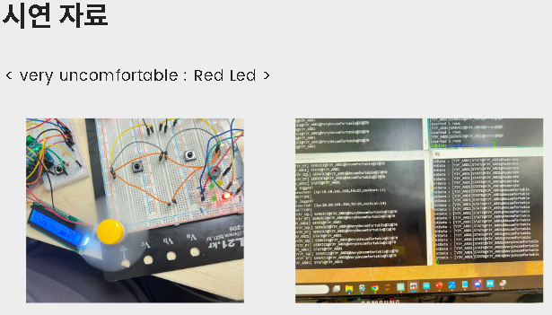
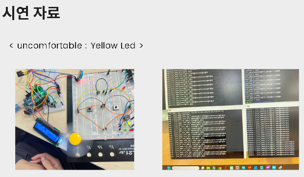
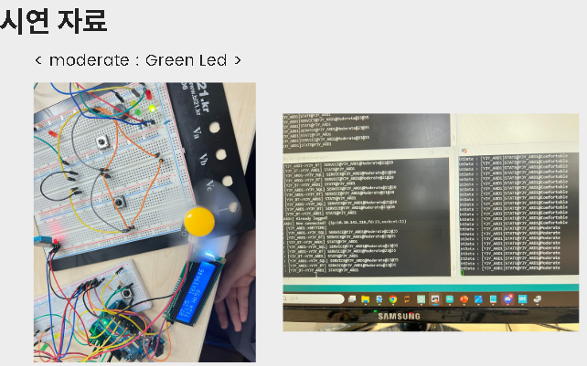

# 🌬️ Smart Ventilator System - 자동 풍속 조절 환풍기

**Intel Edge AI SW Academy 2024**  
**Contributors**: 염재영, 강동혁  

A smart ventilator system designed to automatically adjust fan speed based on real-time temperature and humidity measurements, improving air quality for a healthier living environment. This project leverages IoT sensors, microcontrollers, and a cloud-based database to provide a comprehensive air management solution.

---

## 📖 Table of Contents
1. [Project Overview](#project-overview)
2. [Features](#features)
3. [System Architecture](#system-architecture)
4. [Demonstrations](#demonstrations)
   - [Demo Videos](#demo-videos)
   - [Packet Visualization](#packet-visualization)
5. [Challenges & Improvements](#challenges--improvements)

---

## 📂 Project Overview
- **Project Name**: Smart Ventilator  
- **Purpose**: Enhance indoor air quality by intelligently managing fan speed based on environmental conditions.
- **Key Idea**: Traditional ventilators are limited to manual operation. This project integrates smart sensors and control systems to automate fan speed for optimal air quality and user comfort.

---

## ✨ Features
1. **Real-Time Measurements**:
   - Continuously measures temperature and humidity.
   - Displays data on an LCD screen.
   
2. **Automated Ventilation**:
   - Adjusts fan speed based on environmental data.
   
3. **LED Status Indicators**:
   - 🔴 **Red**: Very Uncomfortable  
   - 🟡 **Yellow**: Uncomfortable  
   - 🟢 **Green**: Moderate/Comfortable  

4. **Alarm System**:
   - Activates a buzzer for immediate notification in extreme conditions.

---

## 🏗️ System Architecture
### **Hardware Overview**
- **Sensors**:
  - Temperature and Humidity (T&H)
- **Microcontrollers**:
  - Arduino Uno
  - STM32-F411RE
- **Cloud Backend**:
  - Raspberry Pi 4B
  - MariaDB for data logging

### **Communication Layers**
- **Protocols**:
  - I2C
  - Bluetooth
  - HTTP
- **Network Components**:
  - MySQL/MariaDB for real-time database management.

### Communication Architecture 

---

## 🎥 Demonstrations
### **Demo Screenshots**
#### 1. **Very Uncomfortable (Red LED)**

#### 2. **Uncomfortable (Yellow LED)**

#### 3. **Moderate/Comfortable (Green LED)**

---

### **Demo Videos**
- **System in Action**:
  [Watch the Full Demo Here](https://example.com)

---

### **Packet Visualization**
- **Client-Server Communication**:
  - Includes real-time logging of temperature and humidity data.
  

---

## ⚙️ Challenges & Improvements
### Challenges:
1. **Sensor Accuracy**:
   - Variations in sensor performance affected detection reliability.
2. **Condition Testing**:
   - Limited ability to simulate diverse environmental conditions in a controlled environment.
   
### Improvements:
1. **Database Utilization**:
   - Exploring advanced ways to analyze historical environmental data.
2. **STM32 Feedback**:
   - Expanding STM32's role for bidirectional control with Arduino.

---

## 💡 Future Plans
- **Integration with mobile apps** for remote control and monitoring.
- **Energy-efficient algorithms** to minimize power consumption.

---

## 📞 Contact Us
For any queries or collaborations, reach out to:  
📧 **[team@example.com](mailto:team@example.com)**  
🌐 **[GitHub Repository](https://github.com/your-repo-link)**

---

🌟 *Thank you for exploring the Smart Ventilator System! Together, let's build smarter and healthier spaces.*  
